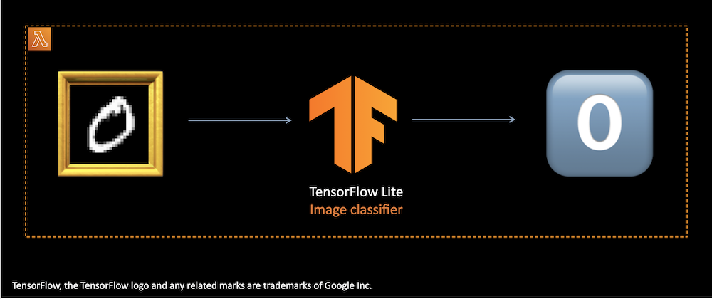

# Serverless ML Inferencing with TensorFlow Lite and AWS Lambda tutorial



This GitHub repository contains the resources to support the ["Serverless ML Inferencing with TensorFlow Lite and AWS Lambda" blog post](https://dev.to/sandeepmistry/serverless-ml-inferencing-with-aws-lambda-and-tensorflow-lite-15el) on [dev.to](dev.to).

To get started with the [Jupyter](https://jupyter.org) [tutorial.ipynb](https://github.com/Assentia/serverless-ml-inferencing-with-tensorflow-lite-and-aws-lambda-tutorial/blob/main/tutorial.ipynb) notebook locally, run:

```bash
git clone https://github.com/Assentia/serverless-ml-inferencing-with-tensorflow-lite-and-aws-lambda-tutorial.git

cd serverless-ml-inferencing-with-tensorflow-lite-and-aws-lambda-tutorial

python3 -m venv .env

. .env/bin/activate

pip install -r requirements.txt

jupyter-lab
```
